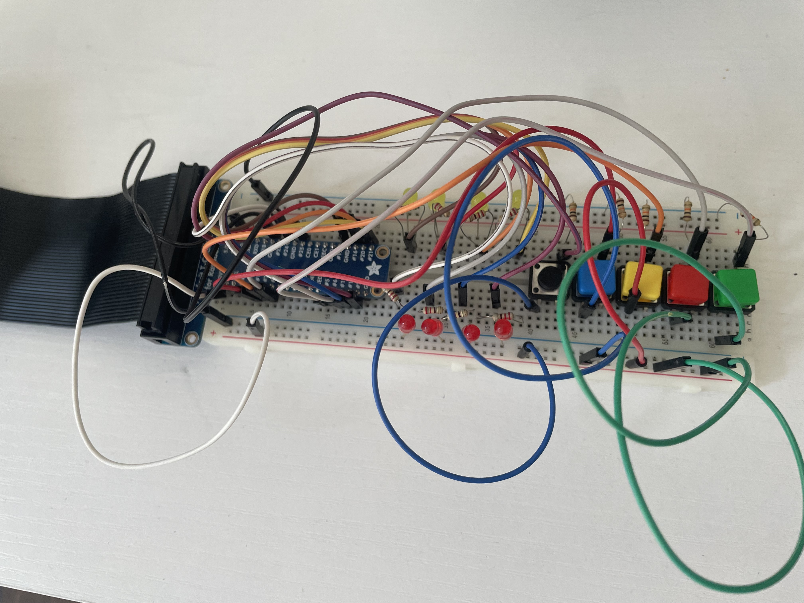

# Mastermind (JavaFX + Raspberry Pi)

A classic Mastermind game built in JavaFX, but with a twist — you don't just click through a screen. Real physical buttons and LEDs (wired up to a Raspberry Pi) let you play the game on actual hardware, with the Pi and the Java game talking to each other over a TCP socket connection.

## How it works

- **`src/Mastermind.java`** — the game logic and JavaFX GUI. Handles the core Mastermind rules (guessing the code, giving feedback on pegs), and sends/receives data over a TCP socket.
- **`raspberrypi/buttons.py`** — runs on the Raspberry Pi. Reads GPIO input from physical buttons and controls LEDs based on game state, communicating with the Java side over the socket.
- **`images/`** — a photo of the actual circuit setup (buttons + LEDs wired to the Pi).

## Tech stack

- Java / JavaFX (game UI and logic)
- Python (Raspberry Pi GPIO control)
- TCP sockets (communication between the Java app and the Pi)
- Raspberry Pi + GPIO (physical buttons and LEDs)

## The circuit

## Running it

You'll need JavaFX set up separately from the JDK (it's not bundled anymore), plus a Raspberry Pi with the GPIO library set up to run `buttons.py`. Run the Pi script first so it's listening, then launch the Java app to connect.
